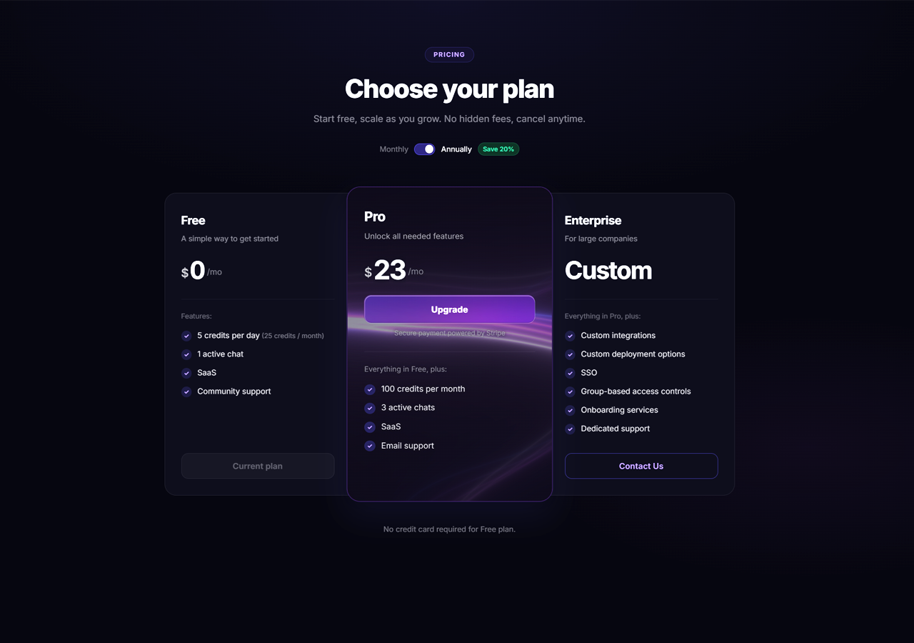

# Pricing Page



A polished, animated SaaS pricing page built with React and Vite. The design centers on a three-tier card layout — Free, Pro, and Enterprise — with the Pro plan as the visual anchor: elevated, scaled up, and brought to life with a real-time WebGL animation.

---

## Design

The page ships in both **dark and light modes**, toggled via a fixed button. Each theme has its own fully resolved color system built on CSS custom properties, so every surface, text level, border, and interactive element adapts cleanly without a single hardcoded override leaking through.

Typography follows a deliberate hierarchy across nine token levels (`--t1` → `--t9`), keeping contrast consistent whether text sits on a static card background or above a moving canvas.

### Pro Card

The Pro card is the centrepiece of the layout. It sits slightly scaled up relative to its siblings and hosts a **live WebGL canvas** that fills the card background with smoothly animated wave lines. The effect responds to mouse movement in real time and is fully configurable through a floating settings panel — animation speed, line count, gradient colors, bend strength, parallax, background color, and more.

To keep text readable above the motion, all color tokens inside the Pro card are resolved to fully opaque equivalents, preventing the canvas from bleeding through glyphs. A soft background-colored `text-shadow` halo adds a further contrast buffer without visibly altering any text color.

The **Upgrade button** uses a glassmorphism treatment inspired by iOS: a semi-transparent frosted gradient, `backdrop-filter` blur, a specular inner highlight on the top edge, and a bottom inner shadow for depth — no outer glow, no position shift on hover.

---

## FloatingLines Effect

The animated wave background is powered by a custom Three.js WebGL fragment shader. It renders layered sine-wave lines in three independently controlled groups, with additive compositing in dark mode and `mix()`-based compositing in light mode to keep colors accurate against both backgrounds. A `bgColor` uniform drives the shader's base fill, so the background color is fully controllable without relying on CSS or WebGL clear color.

> **The FloatingLines component was sourced from [ReactBits](https://reactbits.dev) — a library of animated, ready-to-use React components.**
>
> ```bash
> npx jsrepo@latest add https://reactbits.dev/r/FloatingLines-JS-CSS
> ```

---

## Stack

- **React 18** + **Vite**
- **Three.js** — WebGL fragment shader via a stable `propsRef` render loop
- Plain **CSS** with custom properties — no CSS-in-JS, no utility framework

---

## Getting Started

```bash
npm install
npm run dev
```

Drop a screenshot named `preview.png` in the project root to populate the image at the top of this file.
